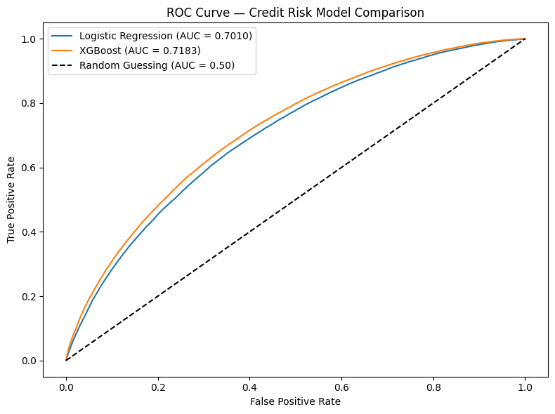
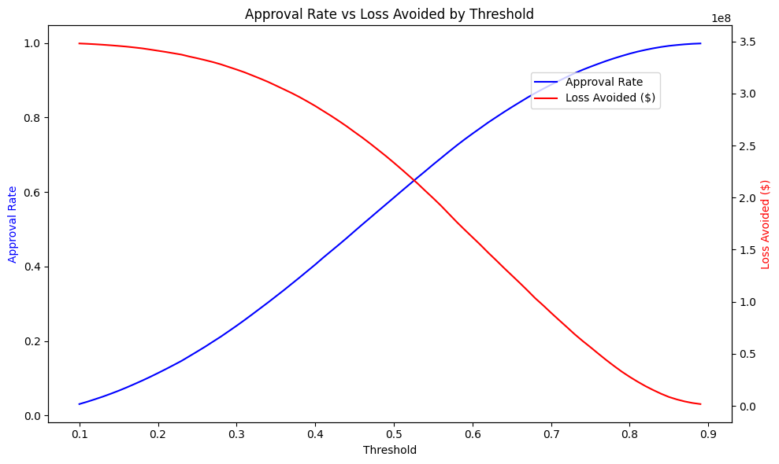

# Credit Risk Scorecard — LendingClub Loan Default Prediction

## Overview
Built an end-to-end credit risk model on 1.3M+ real LendingClub loan records to predict borrower default probability, optimize approval thresholds via business simulation, and explain individual loan decisions using SHAP — mirroring the workflow used by consumer banking credit risk teams.

## Business Problem
Banks need to decide who to approve for loans. Approving risky borrowers leads to losses. Rejecting good borrowers means lost revenue. This project builds a model that finds the optimal balance between those two outcomes.

## Dataset
- Source: LendingClub public loan data (2007–2018), via Kaggle
- 1,345,310 resolved loans (Fully Paid or Charged Off)
- 20% default rate
- 31 features after cleaning and encoding

## Methodology

### 1. Data Cleaning
- Filtered to resolved loans only (removed Current, Late, In Grace Period)
- Handled missing values: median imputation for DTI and revolving utilization, preserved employment length missingness as a separate category (missing not at random)
- One-hot encoded home ownership and loan purpose; ordinally encoded employment length

### 2. Modeling
Trained and compared two models:

| Model | AUC |
|---|---|
| Logistic Regression (baseline) | 0.7010 |
| XGBoost | 0.7183 |

XGBoost outperformed logistic regression at every threshold on the ROC curve.

### 3. Threshold Optimization
Simulated business impact across thresholds 0.10–0.90 using $6,500 average loss per default.

**Optimal threshold: 0.57**
- Approval rate: 70.8%
- Defaults caught: 28,366
- Loss avoided: $184M on held-out test set of 269K loans

### 4. SHAP Explainability
Applied SHAP TreeExplainer to surface feature-level drivers of default risk per applicant — aligning model outputs with adverse action notice requirements under ECOA.

**Top predictors by SHAP importance:**
1. Interest rate (most important)
2. FICO score
3. DTI ratio
4. Loan amount
5. Annual
